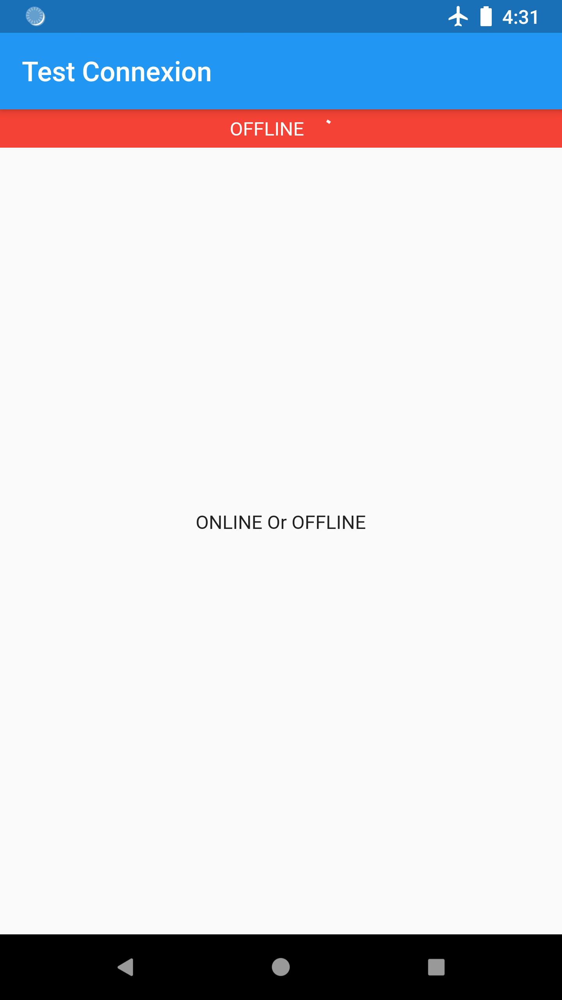

# flutterofflineapp

A new Flutter application.

## Getting Started

This project is a starting point for a Flutter application.

## Screen

<table>
    <tr>
        <td style="padding:5px">
            
        </td>
        <td style="padding:5px">
            
        </td>
    </tr>
</table>

## Following those notes

add two plugins
one for http and other for getting the Device dERECTOis
go to perspec.yaml file
//
http: "0.11.3+17"
path_provider: ^1.1.0
//

let me show you the service url we are going to use
//https://jsonplaceholder.typicode.com/posts
In this service we have 5000 records or albums

Let's create the model class first
for that we need some plugins ..let me show you those.. :
//
//dependencies:
//  json_annotation:

 dev_dependencies:
    json_model:
    build_runner: ^1.0.0
    json_serializable: ^2.0.0
//

to auto-generate Json Models, we need to create a folder named 'jsons' in the root of the project
you can have differentes name as well in that case the folder name should be specied along with the commande in the terminal:

Create the folder 'jsons' first
now copy the json you want to create model for... in the file album.json

we will run a command in the terminal to generate the model,
the generated models will be inside a folder named 'models' insode the 'lib' folder.
let's see how to do it..
flutter packages pub run json_model

Now we have the basic model
but we have a list of Albums, so create another model
Add the albums.json file:
{
  "albums": "$[]album"  //album is the json file name
}
and We run the same commande line to get the files : 'albums.dart' and 'albums.g.dart'

Now we have the both models..
//Let's start by creating a service to get the from from the Service

Now we will add the Sqflite library to create an offline database..
//
sqflite: ^1.1.3
//
link to all libraries used is provided in the description below.
Let's write the basic CRUD operations for saving the albums in the Offline Database...

Create the class DBHelper.dart

