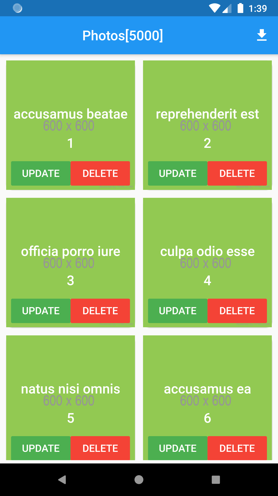
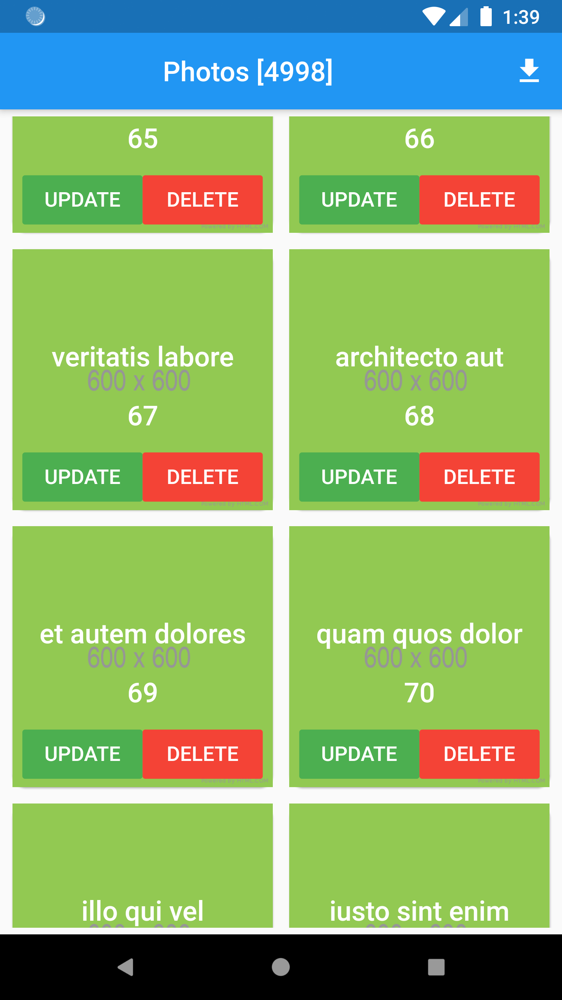
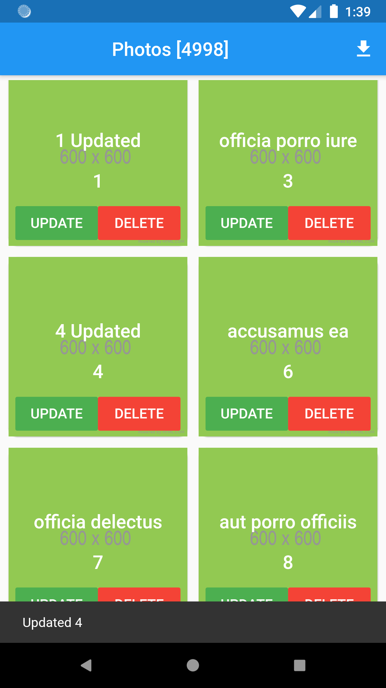
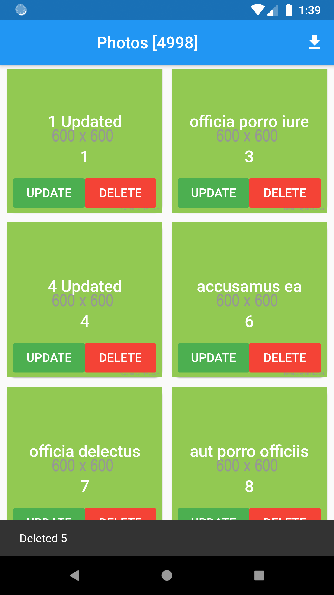

# flutterofflineapp

A new Flutter application.

## Getting Started

This project is a starting point for a Flutter application.

## Following those notes

(+) Add two plugins

(+) one for 'http' and other for getting the 'Device derectories'

-> go to perspec.yaml file

//
http: "0.11.3+17"
path_provider: ^1.1.0
//

* This is the service url we are going to use

-> //https://jsonplaceholder.typicode.com/posts
In this service we have 5000 records or albums

* Create the model class first

(+) We need some plugins.. like those.. :

//
//dependencies:
//  json_annotation:

 dev_dependencies:
    json_model:
    build_runner: ^1.0.0
    json_serializable: ^2.0.0
//

* To auto-generate Json Models, we need to create a folder named 'jsons' in the root of the project

-> We have differentes name as well in that case the folder name should be specied along with the commande in the terminal:

* Create the folder 'jsons' first

(+) Copy the json that we want to create model for... in the file album.json

* Run a command in the terminal to generate the model,

-> The generated models will be inside a folder named 'models' insode the 'lib' folder.
let's see how to do it..

(+) The commande : flutter packages pub run json_model

* Now we have the basic model

-> We have a list of Albums, so create another model

(+) Add the albums.json file:

//
{
  "albums": "$[]album"  //album is the json file name
}
//

(+) Then Run the same commande line to get the files : 'albums.dart' and 'albums.g.dart'

* Now we have the both models..

-> Let's start by creating a service to get the form from the Service

(+) Add the Sqflite library to create an offline database..

//
sqflite: ^1.1.3
//

(+) Let's write the basic CRUD operations for saving the albums in the Offline Database...

* Create the class DBHelper.dart

* Now we will create the service classto get the data from the service.

-> Add the http plugin...
//
http: "0.11.3+17"
//

* Create the class Services.dart

* Use these Database functions now to the DB Operations

-> import these :
//
import 'service/Services.dart';
import 'models/album.dart';
import 'models/albums.dart';
import 'db/DBHelper.dart';
//

* Add the function getPhotos() and the recursive function insert()

(-) Bug :
E/flutter ( 1689): [ERROR:flutter/lib/ui/ui_dart_state.cc(157)] Unhandled Exception: DatabaseException(UNIQUE constraint failed:
albums.id (code 1555)) sql 'INSERT INTO albums (userId, id, title, body) VALUES (NULL, ?, ?, NULL)' args [3, officia porro iure quia iusto qui ipsa ut modi]}

* We will create a GridView to show the Data...

(+) Create the class from each Cell in the GridView

(+) Create the class GridCell.dart

* Edit the GridCell

(+) Fix the Column

(+) Add Two Other buttons for the Delete and the Update

(+) Pass the Update and Delete function as Constructor Parameter in the GridCell.dart

* Go the the Ui (main.dart) and add the GridCell.

FutureBuilder<Albums>()...

(+) Add the gridview function

(+) Add the Update and Delete function

(+) Add the Refresh the List after the DB Operations

(+) Add Simple Snackbar

* Add the "GlobalKey<ScaffoldState>" to the Scaffold

(-) Bug with the delete function

* We will add a progressbar while inserting the album records

(+) LinearProgressIndicator()

(+) Calculate the percent : (counter / albums.albums.length * 100) / 100;

## Screen

* the Offline Builder test

<table>
    <tr>
        <td style="padding:5px">
            
        </td>
        <td style="padding:5px">
            
        </td>
    </tr>
</table>

* the Click on the update button

<table>
    <tr>
        <td style="padding:5px">
            
        </td>
        <td style="padding:5px">
            
        </td>
    </tr>
</table>

* the GridView photos

<table>
    <tr>
        <td style="padding:5px">
            
        </td>
        <td style="padding:5px">
            
        </td>
    </tr>
</table>

* the Actions : Update and Delete

<table>
    <tr>
        <td style="padding:5px">
            
        </td>
        <td style="padding:5px">
            
        </td>
    </tr>
</table>
